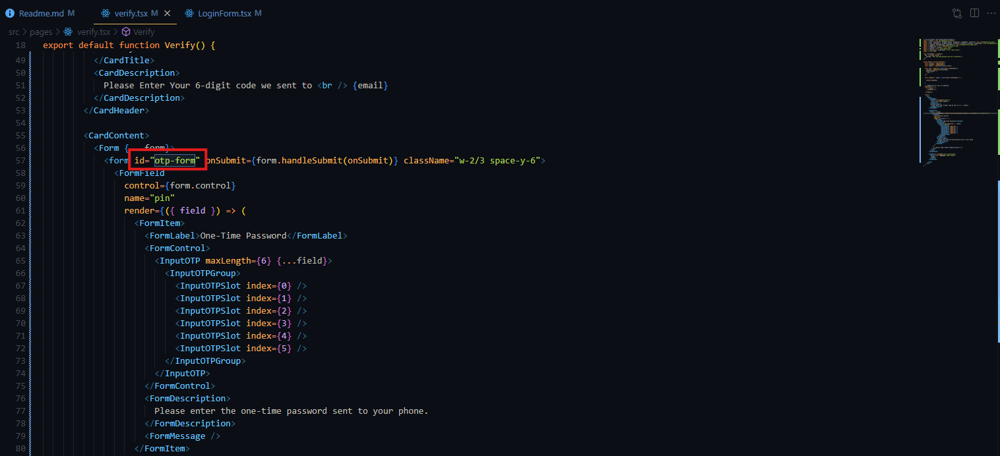
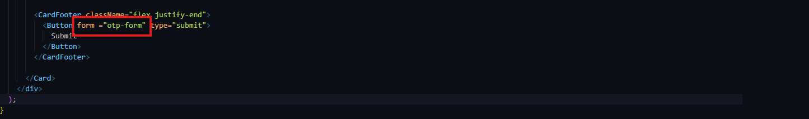

# PH-TOUR-MANAGEMENT-FRONTEND-3

GitHub Link: https://github.com/Apollo-Level2-Web-Dev/ph-tour-management-system-frontend/tree/part-3

## 37-1 Creating the OTP Input Card Interface

- Install otp component form shadcn

```
bunx --bun shadcn@latest add input-otp
```

- Making the submit button out of the form
  
  

- pages -> verify.tsx

```tsx
/* eslint-disable react-hooks/exhaustive-deps */
import { Button } from "@/components/ui/button";
import {
  Card,
  CardContent,
  CardDescription,
  CardFooter,
  CardHeader,
  CardTitle,
} from "@/components/ui/card";
import {
  Form,
  FormControl,
  FormDescription,
  FormField,
  FormItem,
  FormLabel,
  FormMessage,
} from "@/components/ui/form";
import {
  InputOTP,
  InputOTPGroup,
  InputOTPSlot,
} from "@/components/ui/input-otp";
import { zodResolver } from "@hookform/resolvers/zod";
import { useEffect, useState } from "react";
import { useForm } from "react-hook-form";
import { useLocation, useNavigate } from "react-router";
import z from "zod";

const FormSchema = z.object({
  pin: z.string().min(6, {
    message: "Your one-time password must be 6 characters.",
  }),
});

export default function Verify() {
  const location = useLocation();
  const navigate = useNavigate();
  const [email] = useState(location.state);

  const form = useForm<z.infer<typeof FormSchema>>({
    resolver: zodResolver(FormSchema),
    defaultValues: {
      pin: "",
    },
  });

  const onSubmit = (data: z.infer<typeof FormSchema>) => {
    console.log(data);
  };

  //! Needed but for now its commented
  useEffect(() => {
    if (!email) {
      navigate("/");
    }
  }, [email]);

  return (
    <div className="grid place-content-center h-screen">
      <Card className="max-w-fit">
        <CardHeader>
          <CardTitle className="text-xl">Verify Your Email Address !</CardTitle>
          <CardDescription>
            Please Enter Your 6-digit code we sent to <br /> {email}
          </CardDescription>
        </CardHeader>

        <CardContent>
          <Form {...form}>
            <form
              id="otp-form"
              onSubmit={form.handleSubmit(onSubmit)}
              className="w-2/3 space-y-6"
            >
              <FormField
                control={form.control}
                name="pin"
                render={({ field }) => (
                  <FormItem>
                    <FormLabel>One-Time Password</FormLabel>
                    <FormControl>
                      <InputOTP maxLength={6} {...field}>
                        <InputOTPGroup>
                          <InputOTPSlot index={0} />
                          <InputOTPSlot index={1} />
                          <InputOTPSlot index={2} />
                          <InputOTPSlot index={3} />
                          <InputOTPSlot index={4} />
                          <InputOTPSlot index={5} />
                        </InputOTPGroup>
                      </InputOTP>
                    </FormControl>
                    <FormDescription>
                      Please enter the one-time password sent to your phone.
                    </FormDescription>
                    <FormMessage />
                  </FormItem>
                )}
              />
              {/* <Button type="submit">Submit</Button> */}
            </form>
          </Form>
        </CardContent>

        <CardFooter className="flex justify-end">
          <Button form="otp-form" type="submit">
            Submit
          </Button>
        </CardFooter>
      </Card>
    </div>
  );
}
```

## 37-2 Sending OTP Code with Type-Safe RTK Query Mutation

- auth.api.ts

```ts
import { baseApi } from "@/redux/baseApi";
interface ISendOTP {
  email: string;
}
const authApi = baseApi.injectEndpoints({
  endpoints: (builder) => ({
    login: builder.mutation({
      query: (userInfo) => ({
        url: "/auth/login",
        method: "POST",
        data: userInfo, // regular method is body : userInfo. If we use axios we have to use data otherwise we will not get payload
      }),
    }),
    register: builder.mutation({
      query: (userInfo) => ({
        url: "/user/register",
        method: "POST",
        data: userInfo, // regular method is body : userInfo. If we use axios we have to use data otherwise we will not get payload
      }),
    }),
    sendOtp: builder.mutation<null, ISendOTP>({
      query: (userInfo) => ({
        url: "/otp/send",
        method: "POST",
        data: userInfo,
      }),
    }),
  }),
});

export const { useRegisterMutation, useLoginMutation, useSendOtpMutation } =
  authApi;
```

- verify.tsx

```tsx
/* eslint-disable react-hooks/exhaustive-deps */
import { Button } from "@/components/ui/button";
import {
  Card,
  CardContent,
  CardDescription,
  CardFooter,
  CardHeader,
  CardTitle,
} from "@/components/ui/card";
import {
  Form,
  FormControl,
  FormDescription,
  FormField,
  FormItem,
  FormLabel,
  FormMessage,
} from "@/components/ui/form";
import {
  InputOTP,
  InputOTPGroup,
  InputOTPSlot,
} from "@/components/ui/input-otp";
import { useSendOtpMutation } from "@/redux/features/auth/auth.api";
import { zodResolver } from "@hookform/resolvers/zod";
import { Dot } from "lucide-react";
import { useEffect, useState } from "react";
import { useForm } from "react-hook-form";
import { useLocation, useNavigate } from "react-router";
import z from "zod";

const FormSchema = z.object({
  pin: z.string().min(6, {
    message: "Your one-time password must be 6 characters.",
  }),
});

export default function Verify() {
  const location = useLocation();
  const navigate = useNavigate();
  const [email] = useState(location.state);
  const [confirmed, setConfirmed] = useState(false);
  const [sendOtp] = useSendOtpMutation();

  const form = useForm<z.infer<typeof FormSchema>>({
    resolver: zodResolver(FormSchema),
    defaultValues: {
      pin: "",
    },
  });

  const handleConfirm = () => {
    setConfirmed(true);
    sendOtp({ email: email });
  };
  const onSubmit = (data: z.infer<typeof FormSchema>) => {
    console.log(data);
  };

  //! Needed but for now its commented
  useEffect(() => {
    if (!email) {
      navigate("/");
    }
  }, [email]);

  return (
    <div className="grid place-content-center h-screen">
      {confirmed ? (
        <Card className="max-w-fit">
          <CardHeader>
            <CardTitle className="text-xl">
              Verify Your Email Address !
            </CardTitle>
            <CardDescription>
              Please Enter Your 6-digit code we sent to <br /> {email}
            </CardDescription>
          </CardHeader>

          <CardContent>
            <Form {...form}>
              <form
                id="otp-form"
                onSubmit={form.handleSubmit(onSubmit)}
                className=" space-y-6"
              >
                <FormField
                  control={form.control}
                  name="pin"
                  render={({ field }) => (
                    <FormItem>
                      <FormLabel>One-Time Password</FormLabel>
                      <FormControl>
                        <InputOTP maxLength={6} {...field}>
                          <InputOTPGroup>
                            <InputOTPSlot index={0} />
                          </InputOTPGroup>
                          <InputOTPGroup>
                            <InputOTPSlot index={1} />
                          </InputOTPGroup>
                          <InputOTPGroup>
                            <InputOTPSlot index={2} />
                          </InputOTPGroup>
                          <Dot />
                          <InputOTPGroup>
                            <InputOTPSlot index={3} />
                          </InputOTPGroup>
                          <InputOTPGroup>
                            <InputOTPSlot index={4} />
                          </InputOTPGroup>
                          <InputOTPGroup>
                            <InputOTPSlot index={5} />
                          </InputOTPGroup>
                        </InputOTP>
                      </FormControl>
                      <FormDescription className="sr-only">
                        Please enter the one-time password sent to your phone.
                      </FormDescription>
                      <FormMessage />
                    </FormItem>
                  )}
                />
              </form>
            </Form>
          </CardContent>

          <CardFooter className="flex justify-end">
            <Button form="otp-form" type="submit">
              Submit
            </Button>
          </CardFooter>
        </Card>
      ) : (
        <Card className="max-w-fit">
          <CardHeader>
            <CardTitle className="text-xl">
              Verify Your Email Address !
            </CardTitle>
            <CardDescription>
              We will send You an Otp at <br /> {email}
            </CardDescription>
          </CardHeader>

          <CardFooter className="flex justify-end">
            <Button onClick={handleConfirm} className="w-[350px]">
              Confirm
            </Button>
          </CardFooter>
        </Card>
      )}
    </div>
  );
}
```

- lets separate the types

- auth.type.ts

```ts
export interface ISendOTP {
  email: string;
}

export interface ILogin {
  email: string;
  password: string;
}

export interface IRegister {
  name: string;
  phone: string;
  email: string;
  address: string;
  password: string;
}
```

- lets grab the type in index file types -> index.ts

```ts
export type { ISendOTP, ILogin, IRegister } from "./auth.type";
```

- The facility of this is the type file will give the type and it will not be coming from the auth.type.ts. index.ts will grab and send the type. Kind of centralizing the type

- redux - > features -> auth -> auth.api.ts

```ts
import { baseApi } from "@/redux/baseApi";
import type { ILogin, ISendOTP } from "@/types";

const authApi = baseApi.injectEndpoints({
  endpoints: (builder) => ({
    login: builder.mutation<null, ILogin>({
      query: (userInfo) => ({
        url: "/auth/login",
        method: "POST",
        data: userInfo,
      }),
    }),
    register: builder.mutation({
      query: (userInfo) => ({
        url: "/user/register",
        method: "POST",
        data: userInfo,
      }),
    }),
    sendOtp: builder.mutation<null, ISendOTP>({
      query: (userInfo) => ({
        url: "/otp/send",
        method: "POST",
        data: userInfo,
      }),
    }),
  }),
});

export const { useRegisterMutation, useLoginMutation, useSendOtpMutation } =
  authApi;
```

- so far we have gave response type null. now lets make a strict response type
- we will generate this type using our response

[Response Type Generation](https://transform.tools/json-to-typescript)

- as the response is same for all the types we will create in common types -> index.ts file
- The data type will be dynamic each endpoints will generate data accordingly the type we have defined for this we will create a generic data type

- index.ts

```ts
/* eslint-disable @typescript-eslint/no-explicit-any */

export type { ISendOTP, ILogin, IRegister } from "./auth.type";

export interface IResponse<T> {
  statusCode: number;
  success: boolean;
  message: string;
  data: T;
}
```

- redux -> features -> auth -> auth.api.ts

```ts
import { baseApi } from "@/redux/baseApi";
import type { ILogin, IResponse, ISendOTP } from "@/types";

const authApi = baseApi.injectEndpoints({
  endpoints: (builder) => ({
    login: builder.mutation<null, ILogin>({
      query: (userInfo) => ({
        url: "/auth/login",
        method: "POST",
        data: userInfo,
      }),
    }),
    register: builder.mutation({
      query: (userInfo) => ({
        url: "/user/register",
        method: "POST",
        data: userInfo,
      }),
    }),
    sendOtp: builder.mutation<IResponse<null>, ISendOTP>({
      query: (userInfo) => ({
        url: "/otp/send",
        method: "POST",
        data: userInfo,
      }),
    }),
  }),
});

export const { useRegisterMutation, useLoginMutation, useSendOtpMutation } =
  authApi;
```

- Now we can get auto suggestions

```ts
const handleConfirm = async () => {
  try {
    const res = await sendOtp({ email: email }).unwrap();

    if (res.success) {
      toast.success(res.message);
    }

    setConfirmed(true);
  } catch (err) {
    console.log(err);
  }
};
```

- verify.tsx

```tsx
/* eslint-disable react-hooks/exhaustive-deps */
import { Button } from "@/components/ui/button";
import {
  Card,
  CardContent,
  CardDescription,
  CardFooter,
  CardHeader,
  CardTitle,
} from "@/components/ui/card";
import {
  Form,
  FormControl,
  FormDescription,
  FormField,
  FormItem,
  FormLabel,
  FormMessage,
} from "@/components/ui/form";
import {
  InputOTP,
  InputOTPGroup,
  InputOTPSlot,
} from "@/components/ui/input-otp";
import { useSendOtpMutation } from "@/redux/features/auth/auth.api";
import { zodResolver } from "@hookform/resolvers/zod";
import { Dot } from "lucide-react";
import { useEffect, useState } from "react";
import { useForm } from "react-hook-form";
import { useLocation, useNavigate } from "react-router";
import { toast } from "sonner";
import z from "zod";

const FormSchema = z.object({
  pin: z.string().min(6, {
    message: "Your one-time password must be 6 characters.",
  }),
});

export default function Verify() {
  const location = useLocation();
  const navigate = useNavigate();
  const [email] = useState(location.state);
  const [confirmed, setConfirmed] = useState(false);
  const [sendOtp] = useSendOtpMutation();

  const form = useForm<z.infer<typeof FormSchema>>({
    resolver: zodResolver(FormSchema),
    defaultValues: {
      pin: "",
    },
  });

  const handleConfirm = async () => {
    try {
      const res = await sendOtp({ email: email }).unwrap();

      if (res.success) {
        toast.success(res.message);
      }

      setConfirmed(true);
    } catch (err) {
      console.log(err);
    }
  };
  const onSubmit = (data: z.infer<typeof FormSchema>) => {
    console.log(data);
  };

  //! Needed but for now its commented
  useEffect(() => {
    if (!email) {
      navigate("/");
    }
  }, [email]);

  return (
    <div className="grid place-content-center h-screen">
      {confirmed ? (
        <Card className="max-w-fit">
          <CardHeader>
            <CardTitle className="text-xl">
              Verify Your Email Address !
            </CardTitle>
            <CardDescription>
              Please Enter Your 6-digit code we sent to <br /> {email}
            </CardDescription>
          </CardHeader>

          <CardContent>
            <Form {...form}>
              <form
                id="otp-form"
                onSubmit={form.handleSubmit(onSubmit)}
                className=" space-y-6"
              >
                <FormField
                  control={form.control}
                  name="pin"
                  render={({ field }) => (
                    <FormItem>
                      <FormLabel>One-Time Password</FormLabel>
                      <FormControl>
                        <InputOTP maxLength={6} {...field}>
                          <InputOTPGroup>
                            <InputOTPSlot index={0} />
                          </InputOTPGroup>
                          <InputOTPGroup>
                            <InputOTPSlot index={1} />
                          </InputOTPGroup>
                          <InputOTPGroup>
                            <InputOTPSlot index={2} />
                          </InputOTPGroup>
                          <Dot />
                          <InputOTPGroup>
                            <InputOTPSlot index={3} />
                          </InputOTPGroup>
                          <InputOTPGroup>
                            <InputOTPSlot index={4} />
                          </InputOTPGroup>
                          <InputOTPGroup>
                            <InputOTPSlot index={5} />
                          </InputOTPGroup>
                        </InputOTP>
                      </FormControl>
                      <FormDescription className="sr-only">
                        Please enter the one-time password sent to your phone.
                      </FormDescription>
                      <FormMessage />
                    </FormItem>
                  )}
                />
              </form>
            </Form>
          </CardContent>

          <CardFooter className="flex justify-end">
            <Button form="otp-form" type="submit">
              Submit
            </Button>
          </CardFooter>
        </Card>
      ) : (
        <Card className="max-w-fit">
          <CardHeader>
            <CardTitle className="text-xl">
              Verify Your Email Address !
            </CardTitle>
            <CardDescription>
              We will send You an Otp at <br /> {email}
            </CardDescription>
          </CardHeader>

          <CardFooter className="flex justify-end">
            <Button onClick={handleConfirm} className="w-[350px]">
              Confirm
            </Button>
          </CardFooter>
        </Card>
      )}
    </div>
  );
}
```

## 37-3 Verifying OTP and Handling User Login

- Handling the toast in verify.tsx

```tsx
const handleConfirm = async () => {
  const toastId = toast.loading("sending OTP");
  try {
    const res = await sendOtp({ email: email }).unwrap();

    if (res.success) {
      toast.success(res.message, { id: toastId });
      // Tells the toast library (probably react-hot-toast) to replace the existing toast with ID toastId
      setConfirmed(true);
    }
  } catch (err) {
    console.log(err);
  }
};
```

- lets fix some bug 

- redux -> axiosBaseQuery.tsx 
```tsx 
import { axiosInstance } from "@/lib/axios";
import type { BaseQueryFn } from "@reduxjs/toolkit/query";
import type { AxiosError, AxiosRequestConfig } from "axios";


const axiosBaseQuery =
  (): BaseQueryFn<
    {
      url: string;
      method?: AxiosRequestConfig["method"];
      data?: AxiosRequestConfig["data"];
      params?: AxiosRequestConfig["params"];
      headers?: AxiosRequestConfig["headers"];
    },
    unknown,
    unknown
  > =>
  async ({ url, method, data, params, headers }) => {
    try {
      const result = await axiosInstance({
        url: url,
        method,
        data,
        params,
        headers,
      });
      return { data: result.data };
    } catch (axiosError) {
      const err = axiosError as AxiosError;
      return {
        error: {
          status: err.response?.status,
          data: err.response?.data || err.message,
        },
      };
    }
  };

export default axiosBaseQuery;
```

- types -> auth.typ.ts 

```ts 
export interface ISendOtp {
  email: string;
}

export interface IVerifyOtp {
  email: string;
  otp: string;
}

export interface ILogin {
  email: string;
  password: string;
}
```
- types -> index.ts 

```ts 
export type { ISendOtp, IVerifyOtp, ILogin } from "./auth.type";

export interface IResponse<T> {
  statusCode: number;
  success: boolean;
  message: string;
  data: T;
}
```

- Now Lets Verify The OTP 
- redux -> features -> auth -> auth.api.ts 

```ts
import { baseApi } from "@/redux/baseApi";
import type { IResponse, ISendOtp, IVerifyOtp } from "@/types";


export const authApi = baseApi.injectEndpoints({
  endpoints: (builder) => ({
    login: builder.mutation({
      query: (userInfo) => ({
        url: "/auth/login",
        method: "POST",
        data: userInfo,
      }),
    }),
    register: builder.mutation({
      query: (userInfo) => ({
        url: "/user/register",
        method: "POST",
        data: userInfo,
      }),
    }),
    sendOtp: builder.mutation<IResponse<null>, ISendOtp>({
      query: (userInfo) => ({
        url: "/otp/send",
        method: "POST",
        data: userInfo,
      }),
    }),
    verifyOtp: builder.mutation<IResponse<null>, IVerifyOtp>({
      query: (userInfo) => ({
        url: "/otp/verify",
        method: "POST",
        data: userInfo,
      }),
    }),
  }),
});

export const {
  useRegisterMutation,
  useLoginMutation,
  useSendOtpMutation,
  useVerifyOtpMutation
} = authApi;
```

- pages -> verify.tsx 

```tsx 
/* eslint-disable react-hooks/exhaustive-deps */
import { Button } from "@/components/ui/button";
import { Card, CardContent, CardDescription, CardFooter, CardHeader, CardTitle } from "@/components/ui/card";
import { Form, FormControl, FormDescription, FormField, FormItem, FormLabel, FormMessage } from "@/components/ui/form";
import { InputOTP, InputOTPGroup, InputOTPSlot } from "@/components/ui/input-otp";
import { useSendOtpMutation, useVerifyOtpMutation } from "@/redux/features/auth/auth.api";
import { zodResolver } from "@hookform/resolvers/zod";
import { Dot } from "lucide-react";
import { useEffect, useState } from "react";
import { useForm } from "react-hook-form";
import { useLocation, useNavigate } from "react-router";
import { toast } from "sonner";
import z from "zod";

const FormSchema = z.object({
  pin: z.string().min(6, {
    message: "Your one-time password must be 6 characters.",
  }),
})

export default function Verify() {
  const location = useLocation();
  const navigate = useNavigate();
  const [email] = useState(location.state);
  const [confirmed, setConfirmed] = useState(false)
  const [sendOtp] = useSendOtpMutation()
  const [verifyOtp] = useVerifyOtpMutation()

  const form = useForm<z.infer<typeof FormSchema>>({
    resolver: zodResolver(FormSchema),
    defaultValues: {
      pin: "",
    },
  })

  const handleConfirm = async () => {
    const toastId = toast.loading("sending OTP")
    try {

      const res = await sendOtp({ email: email }).unwrap()

      if (res.success) {
        toast.success(res.message, { id: toastId })
        // Tells the toast library (probably react-hot-toast) to replace the existing toast with ID toastId
        setConfirmed(true)
      }


    } catch (err) {
      console.log(err)
    }
  }
  const onSubmit = async (data: z.infer<typeof FormSchema>) => {
    const toastId = toast.loading("Verifying OTP")
    const userInfo = {
      email,
      otp: data.pin
    }

    try {
      // 
      const res = await verifyOtp(userInfo).unwrap()

      if (res.success) {
        toast.success(res.message, { id: toastId })
        setConfirmed(true)
      }

    } catch (err) {
      console.log(err)
    }

  }

  //! Needed but for now its commented 
  useEffect(() => {
    if (!email) {
      navigate("/");
    }
  }, [email]);

  return (
    <div className="grid place-content-center h-screen">
      {
        confirmed ? <Card className="max-w-fit">
          <CardHeader>
            <CardTitle className="text-xl">
              Verify Your Email Address !
            </CardTitle>
            <CardDescription>
              Please Enter Your 6-digit code we sent to <br /> {email}
            </CardDescription>
          </CardHeader>

          <CardContent>
            <Form {...form}>
              <form id="otp-form" onSubmit={form.handleSubmit(onSubmit)} className=" space-y-6">
                <FormField
                  control={form.control}
                  name="pin"
                  render={({ field }) => (
                    <FormItem>
                      <FormLabel>One-Time Password</FormLabel>
                      <FormControl>
                        <InputOTP maxLength={6} {...field}>
                          <InputOTPGroup>
                            <InputOTPSlot index={0} />
                          </InputOTPGroup>
                          <InputOTPGroup>
                            <InputOTPSlot index={1} />
                          </InputOTPGroup>
                          <InputOTPGroup>
                            <InputOTPSlot index={2} />
                          </InputOTPGroup>
                          <Dot />
                          <InputOTPGroup>
                            <InputOTPSlot index={3} />
                          </InputOTPGroup>
                          <InputOTPGroup>
                            <InputOTPSlot index={4} />
                          </InputOTPGroup>
                          <InputOTPGroup>
                            <InputOTPSlot index={5} />
                          </InputOTPGroup>
                        </InputOTP>
                      </FormControl>
                      <FormDescription className="sr-only">
                        Please enter the one-time password sent to your phone.
                      </FormDescription>
                      <FormMessage />
                    </FormItem>
                  )}
                />
              </form>
            </Form>
          </CardContent>

          <CardFooter className="flex justify-end">
            <Button form="otp-form" type="submit">
              Submit
            </Button>
          </CardFooter>

        </Card> : <Card className="max-w-fit">
          <CardHeader>
            <CardTitle className="text-xl">
              Verify Your Email Address !
            </CardTitle>
            <CardDescription>
              We will send You an Otp at  <br /> {email}
            </CardDescription>
          </CardHeader>

          <CardFooter className="flex justify-end">
            <Button onClick={handleConfirm} className="w-[350px]">
              Confirm
            </Button>
          </CardFooter>

        </Card>
      }
    </div >
  );
}
```