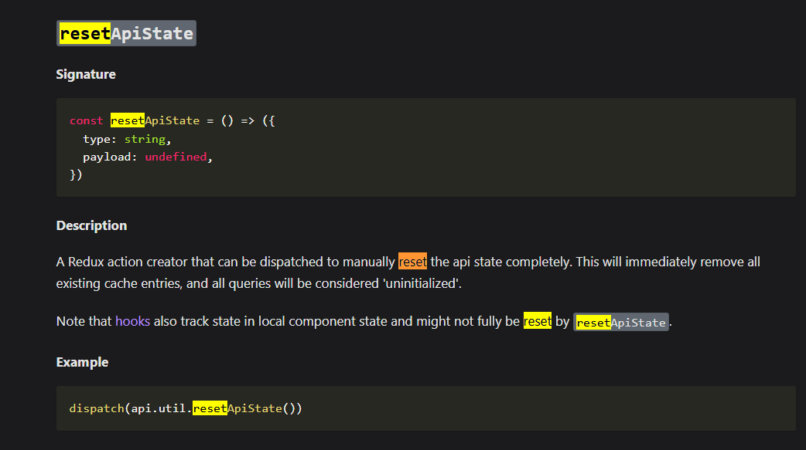

# PH-TOUR-MANAGEMENT-FRONTEND-3

GitHub Link: https://github.com/Apollo-Level2-Web-Dev/ph-tour-management-system-frontend/tree/part-3

## 37-1 Creating the OTP Input Card Interface

- Install otp component form shadcn

```
bunx --bun shadcn@latest add input-otp
```

- Making the submit button out of the form
  
  

- pages -> verify.tsx

```tsx
/* eslint-disable react-hooks/exhaustive-deps */
import { Button } from "@/components/ui/button";
import {
  Card,
  CardContent,
  CardDescription,
  CardFooter,
  CardHeader,
  CardTitle,
} from "@/components/ui/card";
import {
  Form,
  FormControl,
  FormDescription,
  FormField,
  FormItem,
  FormLabel,
  FormMessage,
} from "@/components/ui/form";
import {
  InputOTP,
  InputOTPGroup,
  InputOTPSlot,
} from "@/components/ui/input-otp";
import { zodResolver } from "@hookform/resolvers/zod";
import { useEffect, useState } from "react";
import { useForm } from "react-hook-form";
import { useLocation, useNavigate } from "react-router";
import z from "zod";

const FormSchema = z.object({
  pin: z.string().min(6, {
    message: "Your one-time password must be 6 characters.",
  }),
});

export default function Verify() {
  const location = useLocation();
  const navigate = useNavigate();
  const [email] = useState(location.state);

  const form = useForm<z.infer<typeof FormSchema>>({
    resolver: zodResolver(FormSchema),
    defaultValues: {
      pin: "",
    },
  });

  const onSubmit = (data: z.infer<typeof FormSchema>) => {
    console.log(data);
  };

  //! Needed but for now its commented
  useEffect(() => {
    if (!email) {
      navigate("/");
    }
  }, [email]);

  return (
    <div className="grid place-content-center h-screen">
      <Card className="max-w-fit">
        <CardHeader>
          <CardTitle className="text-xl">Verify Your Email Address !</CardTitle>
          <CardDescription>
            Please Enter Your 6-digit code we sent to <br /> {email}
          </CardDescription>
        </CardHeader>

        <CardContent>
          <Form {...form}>
            <form
              id="otp-form"
              onSubmit={form.handleSubmit(onSubmit)}
              className="w-2/3 space-y-6"
            >
              <FormField
                control={form.control}
                name="pin"
                render={({ field }) => (
                  <FormItem>
                    <FormLabel>One-Time Password</FormLabel>
                    <FormControl>
                      <InputOTP maxLength={6} {...field}>
                        <InputOTPGroup>
                          <InputOTPSlot index={0} />
                          <InputOTPSlot index={1} />
                          <InputOTPSlot index={2} />
                          <InputOTPSlot index={3} />
                          <InputOTPSlot index={4} />
                          <InputOTPSlot index={5} />
                        </InputOTPGroup>
                      </InputOTP>
                    </FormControl>
                    <FormDescription>
                      Please enter the one-time password sent to your phone.
                    </FormDescription>
                    <FormMessage />
                  </FormItem>
                )}
              />
              {/* <Button type="submit">Submit</Button> */}
            </form>
          </Form>
        </CardContent>

        <CardFooter className="flex justify-end">
          <Button form="otp-form" type="submit">
            Submit
          </Button>
        </CardFooter>
      </Card>
    </div>
  );
}
```

## 37-2 Sending OTP Code with Type-Safe RTK Query Mutation

- auth.api.ts

```ts
import { baseApi } from "@/redux/baseApi";
interface ISendOTP {
  email: string;
}
const authApi = baseApi.injectEndpoints({
  endpoints: (builder) => ({
    login: builder.mutation({
      query: (userInfo) => ({
        url: "/auth/login",
        method: "POST",
        data: userInfo, // regular method is body : userInfo. If we use axios we have to use data otherwise we will not get payload
      }),
    }),
    register: builder.mutation({
      query: (userInfo) => ({
        url: "/user/register",
        method: "POST",
        data: userInfo, // regular method is body : userInfo. If we use axios we have to use data otherwise we will not get payload
      }),
    }),
    sendOtp: builder.mutation<null, ISendOTP>({
      query: (userInfo) => ({
        url: "/otp/send",
        method: "POST",
        data: userInfo,
      }),
    }),
  }),
});

export const { useRegisterMutation, useLoginMutation, useSendOtpMutation } =
  authApi;
```

- verify.tsx

```tsx
/* eslint-disable react-hooks/exhaustive-deps */
import { Button } from "@/components/ui/button";
import {
  Card,
  CardContent,
  CardDescription,
  CardFooter,
  CardHeader,
  CardTitle,
} from "@/components/ui/card";
import {
  Form,
  FormControl,
  FormDescription,
  FormField,
  FormItem,
  FormLabel,
  FormMessage,
} from "@/components/ui/form";
import {
  InputOTP,
  InputOTPGroup,
  InputOTPSlot,
} from "@/components/ui/input-otp";
import { useSendOtpMutation } from "@/redux/features/auth/auth.api";
import { zodResolver } from "@hookform/resolvers/zod";
import { Dot } from "lucide-react";
import { useEffect, useState } from "react";
import { useForm } from "react-hook-form";
import { useLocation, useNavigate } from "react-router";
import z from "zod";

const FormSchema = z.object({
  pin: z.string().min(6, {
    message: "Your one-time password must be 6 characters.",
  }),
});

export default function Verify() {
  const location = useLocation();
  const navigate = useNavigate();
  const [email] = useState(location.state);
  const [confirmed, setConfirmed] = useState(false);
  const [sendOtp] = useSendOtpMutation();

  const form = useForm<z.infer<typeof FormSchema>>({
    resolver: zodResolver(FormSchema),
    defaultValues: {
      pin: "",
    },
  });

  const handleConfirm = () => {
    setConfirmed(true);
    sendOtp({ email: email });
  };
  const onSubmit = (data: z.infer<typeof FormSchema>) => {
    console.log(data);
  };

  //! Needed but for now its commented
  useEffect(() => {
    if (!email) {
      navigate("/");
    }
  }, [email]);

  return (
    <div className="grid place-content-center h-screen">
      {confirmed ? (
        <Card className="max-w-fit">
          <CardHeader>
            <CardTitle className="text-xl">
              Verify Your Email Address !
            </CardTitle>
            <CardDescription>
              Please Enter Your 6-digit code we sent to <br /> {email}
            </CardDescription>
          </CardHeader>

          <CardContent>
            <Form {...form}>
              <form
                id="otp-form"
                onSubmit={form.handleSubmit(onSubmit)}
                className=" space-y-6"
              >
                <FormField
                  control={form.control}
                  name="pin"
                  render={({ field }) => (
                    <FormItem>
                      <FormLabel>One-Time Password</FormLabel>
                      <FormControl>
                        <InputOTP maxLength={6} {...field}>
                          <InputOTPGroup>
                            <InputOTPSlot index={0} />
                          </InputOTPGroup>
                          <InputOTPGroup>
                            <InputOTPSlot index={1} />
                          </InputOTPGroup>
                          <InputOTPGroup>
                            <InputOTPSlot index={2} />
                          </InputOTPGroup>
                          <Dot />
                          <InputOTPGroup>
                            <InputOTPSlot index={3} />
                          </InputOTPGroup>
                          <InputOTPGroup>
                            <InputOTPSlot index={4} />
                          </InputOTPGroup>
                          <InputOTPGroup>
                            <InputOTPSlot index={5} />
                          </InputOTPGroup>
                        </InputOTP>
                      </FormControl>
                      <FormDescription className="sr-only">
                        Please enter the one-time password sent to your phone.
                      </FormDescription>
                      <FormMessage />
                    </FormItem>
                  )}
                />
              </form>
            </Form>
          </CardContent>

          <CardFooter className="flex justify-end">
            <Button form="otp-form" type="submit">
              Submit
            </Button>
          </CardFooter>
        </Card>
      ) : (
        <Card className="max-w-fit">
          <CardHeader>
            <CardTitle className="text-xl">
              Verify Your Email Address !
            </CardTitle>
            <CardDescription>
              We will send You an Otp at <br /> {email}
            </CardDescription>
          </CardHeader>

          <CardFooter className="flex justify-end">
            <Button onClick={handleConfirm} className="w-[350px]">
              Confirm
            </Button>
          </CardFooter>
        </Card>
      )}
    </div>
  );
}
```

- lets separate the types

- auth.type.ts

```ts
export interface ISendOTP {
  email: string;
}

export interface ILogin {
  email: string;
  password: string;
}

export interface IRegister {
  name: string;
  phone: string;
  email: string;
  address: string;
  password: string;
}
```

- lets grab the type in index file types -> index.ts

```ts
export type { ISendOTP, ILogin, IRegister } from "./auth.type";
```

- The facility of this is the type file will give the type and it will not be coming from the auth.type.ts. index.ts will grab and send the type. Kind of centralizing the type

- redux - > features -> auth -> auth.api.ts

```ts
import { baseApi } from "@/redux/baseApi";
import type { ILogin, ISendOTP } from "@/types";

const authApi = baseApi.injectEndpoints({
  endpoints: (builder) => ({
    login: builder.mutation<null, ILogin>({
      query: (userInfo) => ({
        url: "/auth/login",
        method: "POST",
        data: userInfo,
      }),
    }),
    register: builder.mutation({
      query: (userInfo) => ({
        url: "/user/register",
        method: "POST",
        data: userInfo,
      }),
    }),
    sendOtp: builder.mutation<null, ISendOTP>({
      query: (userInfo) => ({
        url: "/otp/send",
        method: "POST",
        data: userInfo,
      }),
    }),
  }),
});

export const { useRegisterMutation, useLoginMutation, useSendOtpMutation } =
  authApi;
```

- so far we have gave response type null. now lets make a strict response type
- we will generate this type using our response

[Response Type Generation](https://transform.tools/json-to-typescript)

- as the response is same for all the types we will create in common types -> index.ts file
- The data type will be dynamic each endpoints will generate data accordingly the type we have defined for this we will create a generic data type

- index.ts

```ts
/* eslint-disable @typescript-eslint/no-explicit-any */

export type { ISendOTP, ILogin, IRegister } from "./auth.type";

export interface IResponse<T> {
  statusCode: number;
  success: boolean;
  message: string;
  data: T;
}
```

- redux -> features -> auth -> auth.api.ts

```ts
import { baseApi } from "@/redux/baseApi";
import type { ILogin, IResponse, ISendOTP } from "@/types";

const authApi = baseApi.injectEndpoints({
  endpoints: (builder) => ({
    login: builder.mutation<null, ILogin>({
      query: (userInfo) => ({
        url: "/auth/login",
        method: "POST",
        data: userInfo,
      }),
    }),
    register: builder.mutation({
      query: (userInfo) => ({
        url: "/user/register",
        method: "POST",
        data: userInfo,
      }),
    }),
    sendOtp: builder.mutation<IResponse<null>, ISendOTP>({
      query: (userInfo) => ({
        url: "/otp/send",
        method: "POST",
        data: userInfo,
      }),
    }),
  }),
});

export const { useRegisterMutation, useLoginMutation, useSendOtpMutation } =
  authApi;
```

- Now we can get auto suggestions

```ts
const handleConfirm = async () => {
  try {
    const res = await sendOtp({ email: email }).unwrap();

    if (res.success) {
      toast.success(res.message);
    }

    setConfirmed(true);
  } catch (err) {
    console.log(err);
  }
};
```

- verify.tsx

```tsx
/* eslint-disable react-hooks/exhaustive-deps */
import { Button } from "@/components/ui/button";
import {
  Card,
  CardContent,
  CardDescription,
  CardFooter,
  CardHeader,
  CardTitle,
} from "@/components/ui/card";
import {
  Form,
  FormControl,
  FormDescription,
  FormField,
  FormItem,
  FormLabel,
  FormMessage,
} from "@/components/ui/form";
import {
  InputOTP,
  InputOTPGroup,
  InputOTPSlot,
} from "@/components/ui/input-otp";
import { useSendOtpMutation } from "@/redux/features/auth/auth.api";
import { zodResolver } from "@hookform/resolvers/zod";
import { Dot } from "lucide-react";
import { useEffect, useState } from "react";
import { useForm } from "react-hook-form";
import { useLocation, useNavigate } from "react-router";
import { toast } from "sonner";
import z from "zod";

const FormSchema = z.object({
  pin: z.string().min(6, {
    message: "Your one-time password must be 6 characters.",
  }),
});

export default function Verify() {
  const location = useLocation();
  const navigate = useNavigate();
  const [email] = useState(location.state);
  const [confirmed, setConfirmed] = useState(false);
  const [sendOtp] = useSendOtpMutation();

  const form = useForm<z.infer<typeof FormSchema>>({
    resolver: zodResolver(FormSchema),
    defaultValues: {
      pin: "",
    },
  });

  const handleConfirm = async () => {
    try {
      const res = await sendOtp({ email: email }).unwrap();

      if (res.success) {
        toast.success(res.message);
      }

      setConfirmed(true);
    } catch (err) {
      console.log(err);
    }
  };
  const onSubmit = (data: z.infer<typeof FormSchema>) => {
    console.log(data);
  };

  //! Needed but for now its commented
  useEffect(() => {
    if (!email) {
      navigate("/");
    }
  }, [email]);

  return (
    <div className="grid place-content-center h-screen">
      {confirmed ? (
        <Card className="max-w-fit">
          <CardHeader>
            <CardTitle className="text-xl">
              Verify Your Email Address !
            </CardTitle>
            <CardDescription>
              Please Enter Your 6-digit code we sent to <br /> {email}
            </CardDescription>
          </CardHeader>

          <CardContent>
            <Form {...form}>
              <form
                id="otp-form"
                onSubmit={form.handleSubmit(onSubmit)}
                className=" space-y-6"
              >
                <FormField
                  control={form.control}
                  name="pin"
                  render={({ field }) => (
                    <FormItem>
                      <FormLabel>One-Time Password</FormLabel>
                      <FormControl>
                        <InputOTP maxLength={6} {...field}>
                          <InputOTPGroup>
                            <InputOTPSlot index={0} />
                          </InputOTPGroup>
                          <InputOTPGroup>
                            <InputOTPSlot index={1} />
                          </InputOTPGroup>
                          <InputOTPGroup>
                            <InputOTPSlot index={2} />
                          </InputOTPGroup>
                          <Dot />
                          <InputOTPGroup>
                            <InputOTPSlot index={3} />
                          </InputOTPGroup>
                          <InputOTPGroup>
                            <InputOTPSlot index={4} />
                          </InputOTPGroup>
                          <InputOTPGroup>
                            <InputOTPSlot index={5} />
                          </InputOTPGroup>
                        </InputOTP>
                      </FormControl>
                      <FormDescription className="sr-only">
                        Please enter the one-time password sent to your phone.
                      </FormDescription>
                      <FormMessage />
                    </FormItem>
                  )}
                />
              </form>
            </Form>
          </CardContent>

          <CardFooter className="flex justify-end">
            <Button form="otp-form" type="submit">
              Submit
            </Button>
          </CardFooter>
        </Card>
      ) : (
        <Card className="max-w-fit">
          <CardHeader>
            <CardTitle className="text-xl">
              Verify Your Email Address !
            </CardTitle>
            <CardDescription>
              We will send You an Otp at <br /> {email}
            </CardDescription>
          </CardHeader>

          <CardFooter className="flex justify-end">
            <Button onClick={handleConfirm} className="w-[350px]">
              Confirm
            </Button>
          </CardFooter>
        </Card>
      )}
    </div>
  );
}
```

## 37-3 Verifying OTP and Handling User Login

- Handling the toast in verify.tsx

```tsx
const handleConfirm = async () => {
  const toastId = toast.loading("sending OTP");
  try {
    const res = await sendOtp({ email: email }).unwrap();

    if (res.success) {
      toast.success(res.message, { id: toastId });
      // Tells the toast library (probably react-hot-toast) to replace the existing toast with ID toastId
      setConfirmed(true);
    }
  } catch (err) {
    console.log(err);
  }
};
```

- lets fix some bug

- redux -> axiosBaseQuery.tsx

```tsx
import { axiosInstance } from "@/lib/axios";
import type { BaseQueryFn } from "@reduxjs/toolkit/query";
import type { AxiosError, AxiosRequestConfig } from "axios";

const axiosBaseQuery =
  (): BaseQueryFn<
    {
      url: string;
      method?: AxiosRequestConfig["method"];
      data?: AxiosRequestConfig["data"];
      params?: AxiosRequestConfig["params"];
      headers?: AxiosRequestConfig["headers"];
    },
    unknown,
    unknown
  > =>
  async ({ url, method, data, params, headers }) => {
    try {
      const result = await axiosInstance({
        url: url,
        method,
        data,
        params,
        headers,
      });
      return { data: result.data };
    } catch (axiosError) {
      const err = axiosError as AxiosError;
      return {
        error: {
          status: err.response?.status,
          data: err.response?.data || err.message,
        },
      };
    }
  };

export default axiosBaseQuery;
```

- types -> auth.typ.ts

```ts
export interface ISendOtp {
  email: string;
}

export interface IVerifyOtp {
  email: string;
  otp: string;
}

export interface ILogin {
  email: string;
  password: string;
}
```

- types -> index.ts

```ts
export type { ISendOtp, IVerifyOtp, ILogin } from "./auth.type";

export interface IResponse<T> {
  statusCode: number;
  success: boolean;
  message: string;
  data: T;
}
```

- Now Lets Verify The OTP
- redux -> features -> auth -> auth.api.ts

```ts
import { baseApi } from "@/redux/baseApi";
import type { IResponse, ISendOtp, IVerifyOtp } from "@/types";

export const authApi = baseApi.injectEndpoints({
  endpoints: (builder) => ({
    login: builder.mutation({
      query: (userInfo) => ({
        url: "/auth/login",
        method: "POST",
        data: userInfo,
      }),
    }),
    register: builder.mutation({
      query: (userInfo) => ({
        url: "/user/register",
        method: "POST",
        data: userInfo,
      }),
    }),
    sendOtp: builder.mutation<IResponse<null>, ISendOtp>({
      query: (userInfo) => ({
        url: "/otp/send",
        method: "POST",
        data: userInfo,
      }),
    }),
    verifyOtp: builder.mutation<IResponse<null>, IVerifyOtp>({
      query: (userInfo) => ({
        url: "/otp/verify",
        method: "POST",
        data: userInfo,
      }),
    }),
  }),
});

export const {
  useRegisterMutation,
  useLoginMutation,
  useSendOtpMutation,
  useVerifyOtpMutation,
} = authApi;
```

- pages -> verify.tsx

```tsx
/* eslint-disable react-hooks/exhaustive-deps */
import { Button } from "@/components/ui/button";
import {
  Card,
  CardContent,
  CardDescription,
  CardFooter,
  CardHeader,
  CardTitle,
} from "@/components/ui/card";
import {
  Form,
  FormControl,
  FormDescription,
  FormField,
  FormItem,
  FormLabel,
  FormMessage,
} from "@/components/ui/form";
import {
  InputOTP,
  InputOTPGroup,
  InputOTPSlot,
} from "@/components/ui/input-otp";
import {
  useSendOtpMutation,
  useVerifyOtpMutation,
} from "@/redux/features/auth/auth.api";
import { zodResolver } from "@hookform/resolvers/zod";
import { Dot } from "lucide-react";
import { useEffect, useState } from "react";
import { useForm } from "react-hook-form";
import { useLocation, useNavigate } from "react-router";
import { toast } from "sonner";
import z from "zod";

const FormSchema = z.object({
  pin: z.string().min(6, {
    message: "Your one-time password must be 6 characters.",
  }),
});

export default function Verify() {
  const location = useLocation();
  const navigate = useNavigate();
  const [email] = useState(location.state);
  const [confirmed, setConfirmed] = useState(false);
  const [sendOtp] = useSendOtpMutation();
  const [verifyOtp] = useVerifyOtpMutation();

  const form = useForm<z.infer<typeof FormSchema>>({
    resolver: zodResolver(FormSchema),
    defaultValues: {
      pin: "",
    },
  });

  const handleConfirm = async () => {
    const toastId = toast.loading("sending OTP");
    try {
      const res = await sendOtp({ email: email }).unwrap();

      if (res.success) {
        toast.success(res.message, { id: toastId });
        // Tells the toast library (probably react-hot-toast) to replace the existing toast with ID toastId
        setConfirmed(true);
      }
    } catch (err) {
      console.log(err);
    }
  };
  const onSubmit = async (data: z.infer<typeof FormSchema>) => {
    const toastId = toast.loading("Verifying OTP");
    const userInfo = {
      email,
      otp: data.pin,
    };

    try {
      //
      const res = await verifyOtp(userInfo).unwrap();

      if (res.success) {
        toast.success(res.message, { id: toastId });
        setConfirmed(true);
      }
    } catch (err) {
      console.log(err);
    }
  };

  //! Needed but for now its commented
  useEffect(() => {
    if (!email) {
      navigate("/");
    }
  }, [email]);

  return (
    <div className="grid place-content-center h-screen">
      {confirmed ? (
        <Card className="max-w-fit">
          <CardHeader>
            <CardTitle className="text-xl">
              Verify Your Email Address !
            </CardTitle>
            <CardDescription>
              Please Enter Your 6-digit code we sent to <br /> {email}
            </CardDescription>
          </CardHeader>

          <CardContent>
            <Form {...form}>
              <form
                id="otp-form"
                onSubmit={form.handleSubmit(onSubmit)}
                className=" space-y-6"
              >
                <FormField
                  control={form.control}
                  name="pin"
                  render={({ field }) => (
                    <FormItem>
                      <FormLabel>One-Time Password</FormLabel>
                      <FormControl>
                        <InputOTP maxLength={6} {...field}>
                          <InputOTPGroup>
                            <InputOTPSlot index={0} />
                          </InputOTPGroup>
                          <InputOTPGroup>
                            <InputOTPSlot index={1} />
                          </InputOTPGroup>
                          <InputOTPGroup>
                            <InputOTPSlot index={2} />
                          </InputOTPGroup>
                          <Dot />
                          <InputOTPGroup>
                            <InputOTPSlot index={3} />
                          </InputOTPGroup>
                          <InputOTPGroup>
                            <InputOTPSlot index={4} />
                          </InputOTPGroup>
                          <InputOTPGroup>
                            <InputOTPSlot index={5} />
                          </InputOTPGroup>
                        </InputOTP>
                      </FormControl>
                      <FormDescription className="sr-only">
                        Please enter the one-time password sent to your phone.
                      </FormDescription>
                      <FormMessage />
                    </FormItem>
                  )}
                />
              </form>
            </Form>
          </CardContent>

          <CardFooter className="flex justify-end">
            <Button form="otp-form" type="submit">
              Submit
            </Button>
          </CardFooter>
        </Card>
      ) : (
        <Card className="max-w-fit">
          <CardHeader>
            <CardTitle className="text-xl">
              Verify Your Email Address !
            </CardTitle>
            <CardDescription>
              We will send You an Otp at <br /> {email}
            </CardDescription>
          </CardHeader>

          <CardFooter className="flex justify-end">
            <Button onClick={handleConfirm} className="w-[350px]">
              Confirm
            </Button>
          </CardFooter>
        </Card>
      )}
    </div>
  );
}
```

## 37-4 Managing Status Codes and Fixing Credential Mismatch Issues

- There are some bugs like If password do not match it should not take me to verify page and if otp invalid we should handle this too.
- Done it in LoginForm.tsx
- Though Its Not a Perfect way but for now its done like this in fokira way.

```tsx
/* eslint-disable @typescript-eslint/no-explicit-any */
import { Button } from "@/components/ui/button";
import {
  Form,
  FormControl,
  FormField,
  FormItem,
  FormLabel,
  FormMessage,
} from "@/components/ui/form";
import { Input } from "@/components/ui/input";
import { cn } from "@/lib/utils";
import { useLoginMutation } from "@/redux/features/auth/auth.api";
import { type FieldValues, type SubmitHandler, useForm } from "react-hook-form";
import { Link, useNavigate } from "react-router";
import { toast } from "sonner";

export function LoginForm({
  className,
  ...props
}: React.HTMLAttributes<HTMLDivElement>) {
  const navigate = useNavigate();
  const form = useForm();
  const [login] = useLoginMutation();
  const onSubmit: SubmitHandler<FieldValues> = async (data) => {
    try {
      const res = await login(data).unwrap();
      console.log(res);
    } catch (err: any) {
      console.error(err);

      if (err.data.message === "Password Does Not Match") {
        toast.error("Invalid Credentials!");
      }

      if (err.data.message === "User Is Not Verified") {
        toast.error("Your account is not verified");
        navigate("/verify", { state: data.email });
      }

      // if (err.status === 401) {
      // toast.error("Your account is not verified");
      // navigate("/verify", { state: data.email });
      // }
    }
  };

  return (
    <div className={cn("flex flex-col gap-6", className)} {...props}>
      <div className="flex flex-col items-center gap-2 text-center">
        <h1 className="text-2xl font-bold">Login to your account</h1>
        <p className="text-balance text-sm text-muted-foreground">
          Enter your email below to login to your account
        </p>
      </div>
      <div className="grid gap-6">
        <Form {...form}>
          <form onSubmit={form.handleSubmit(onSubmit)} className="space-y-6">
            <FormField
              control={form.control}
              name="email"
              render={({ field }) => (
                <FormItem>
                  <FormLabel>Email</FormLabel>
                  <FormControl>
                    <Input
                      placeholder="john@example.com"
                      {...field}
                      value={field.value || ""}
                    />
                  </FormControl>
                  <FormMessage />
                </FormItem>
              )}
            />

            <FormField
              control={form.control}
              name="password"
              render={({ field }) => (
                <FormItem>
                  <FormLabel>Password</FormLabel>
                  <FormControl>
                    <Input
                      type="password"
                      placeholder="********"
                      {...field}
                      value={field.value || ""}
                    />
                  </FormControl>
                  <FormMessage />
                </FormItem>
              )}
            />

            <Button type="submit" className="w-full">
              Login
            </Button>
          </form>
        </Form>

        <div className="relative text-center text-sm after:absolute after:inset-0 after:top-1/2 after:z-0 after:flex after:items-center after:border-t after:border-border">
          <span className="relative z-10 bg-background px-2 text-muted-foreground">
            Or continue with
          </span>
        </div>

        <Button
          type="button"
          variant="outline"
          className="w-full cursor-pointer"
        >
          Login with Google
        </Button>
      </div>
      <div className="text-center text-sm">
        Don&apos;t have an account?{" "}
        <Link to="/register" replace className="underline underline-offset-4">
          Register
        </Link>
      </div>
    </div>
  );
}
```

## 37-5 Handling useEffect Cleanup, Reset Button Functionality, and Overview of the cn Utility

- Now Handle The Resend OTP Mechanism

```tsx
/* eslint-disable react-hooks/exhaustive-deps */
import { Button } from "@/components/ui/button";
import {
  Card,
  CardContent,
  CardDescription,
  CardFooter,
  CardHeader,
  CardTitle,
} from "@/components/ui/card";
import {
  Form,
  FormControl,
  FormDescription,
  FormField,
  FormItem,
  FormLabel,
  FormMessage,
} from "@/components/ui/form";
import {
  InputOTP,
  InputOTPGroup,
  InputOTPSlot,
} from "@/components/ui/input-otp";
import { cn } from "@/lib/utils";
import {
  useSendOtpMutation,
  useVerifyOtpMutation,
} from "@/redux/features/auth/auth.api";
import { zodResolver } from "@hookform/resolvers/zod";
import { Dot } from "lucide-react";
import { useEffect, useState } from "react";
import { useForm } from "react-hook-form";
import { useLocation } from "react-router";
import { toast } from "sonner";
import z from "zod";

const FormSchema = z.object({
  pin: z.string().min(6, {
    message: "Your one-time password must be 6 characters.",
  }),
});

export default function Verify() {
  const location = useLocation();
  // const navigate = useNavigate();
  const [email] = useState(location.state);
  const [confirmed, setConfirmed] = useState(false);
  const [sendOtp] = useSendOtpMutation();
  const [verifyOtp] = useVerifyOtpMutation();
  const [timer, setTimer] = useState(5);

  const form = useForm<z.infer<typeof FormSchema>>({
    resolver: zodResolver(FormSchema),
    defaultValues: {
      pin: "",
    },
  });

  const handleSendOtp = async () => {
    const toastId = toast.loading("sending OTP");
    try {
      const res = await sendOtp({ email: email }).unwrap();

      if (res.success) {
        toast.success(res.message, { id: toastId });
        // Tells the toast library (probably react-hot-toast) to replace the existing toast with ID toastId
        setConfirmed(true);
      }
    } catch (err) {
      console.log(err);
    }
  };
  const onSubmit = async (data: z.infer<typeof FormSchema>) => {
    const toastId = toast.loading("Verifying OTP");
    const userInfo = {
      email,
      otp: data.pin,
    };

    try {
      //
      const res = await verifyOtp(userInfo).unwrap();

      if (res.success) {
        toast.success(res.message, { id: toastId });
        setConfirmed(true);
        setTimer(5);
      }
    } catch (err) {
      console.log(err);
    }
  };

  //! Needed but for now its commented
  // useEffect(() => {
  //   if (!email) {
  //     navigate("/");
  //   }
  // }, [email]);

  useEffect(() => {
    if (!email || !confirmed) {
      return;
    }

    const timerId = setInterval(() => {
      setTimer((prev) => (prev > 0 ? prev - 1 : 0));
      console.log("Tick");
    }, 1000);

    return () => clearInterval(timerId);
  }, [email, confirmed]);

  return (
    <div className="grid place-content-center h-screen">
      {confirmed ? (
        <Card className="max-w-fit">
          <CardHeader>
            <CardTitle className="text-xl">
              Verify Your Email Address !
            </CardTitle>
            <CardDescription>
              Please Enter Your 6-digit code we sent to <br /> {email}
            </CardDescription>
          </CardHeader>

          <CardContent>
            <Form {...form}>
              <form
                id="otp-form"
                onSubmit={form.handleSubmit(onSubmit)}
                className=" space-y-6"
              >
                <FormField
                  control={form.control}
                  name="pin"
                  render={({ field }) => (
                    <FormItem>
                      <FormLabel>One-Time Password</FormLabel>
                      <FormControl>
                        <InputOTP maxLength={6} {...field}>
                          <InputOTPGroup>
                            <InputOTPSlot index={0} />
                          </InputOTPGroup>
                          <InputOTPGroup>
                            <InputOTPSlot index={1} />
                          </InputOTPGroup>
                          <InputOTPGroup>
                            <InputOTPSlot index={2} />
                          </InputOTPGroup>
                          <Dot />
                          <InputOTPGroup>
                            <InputOTPSlot index={3} />
                          </InputOTPGroup>
                          <InputOTPGroup>
                            <InputOTPSlot index={4} />
                          </InputOTPGroup>
                          <InputOTPGroup>
                            <InputOTPSlot index={5} />
                          </InputOTPGroup>
                        </InputOTP>
                      </FormControl>
                      <FormDescription>
                        <Button
                          onClick={handleSendOtp}
                          type="button"
                          variant="link"
                          disabled={timer !== 0}
                          className={cn("p-0 m-0", {
                            "cursor-pointer": timer === 0,
                            "text-gray-500": timer !== 0,
                          })}
                        >
                          Resent OPT:{" "}
                        </Button>{" "}
                        {timer}
                      </FormDescription>
                      <FormMessage />
                    </FormItem>
                  )}
                />
              </form>
            </Form>
          </CardContent>

          <CardFooter className="flex justify-end">
            <Button form="otp-form" type="submit">
              Submit
            </Button>
          </CardFooter>
        </Card>
      ) : (
        <Card className="max-w-fit">
          <CardHeader>
            <CardTitle className="text-xl">
              Verify Your Email Address !
            </CardTitle>
            <CardDescription>
              We will send You an Otp at <br /> {email}
            </CardDescription>
          </CardHeader>

          <CardFooter className="flex justify-end">
            <Button onClick={handleSendOtp} className="w-[350px]">
              Confirm
            </Button>
          </CardFooter>
        </Card>
      )}
    </div>
  );
}
```

- what is the works?

```tsx
useEffect(() => {
  if (!email || !confirmed) {
    return;
  }
  // If email is missing or confirmed is false, don’t start the timer.

  const timerId = setInterval(() => {
    setTimer((prev) => (prev > 0 ? prev - 1 : 0));
    // setTimer reduces the timer value by 1 each second, but stops at 0 (no negative countdown).
    console.log("Tick");
  }, 1000);

  // initially if there is email and is confirmed the timer id is reset each time so that two time re render do not show imbalance
  return () => clearInterval(timerId);
  // When the effect re-runs or the component unmounts, clearInterval stops the old timer.
  // This prevents multiple timers from running at once — which would cause the “imbalance” you mentioned (e.g., double countdown speed).
}, [email, confirmed]);
```

## 37-6 Exploring Token Management Strategies and Choosing the Right Approach

- After Login We are Getting access token and refresh Token in Response and also getting the tokens in cookies.
- For token we can use `Authorization Header` or `Cookie ` As Well, The Secure was is Setting In `Cookie` because in case of `Authorization Header` we must have to store the tokens somewhere (local Storage or session storage) and this is not secure. Local storage has security issue and session storage has issues like if we reload the session tokens will be disappeared. we have to send the token using `HTTP ONLY COOKIE` that means the cookies will go to backend only using http request only.

## 37-7 Accessing Cookies on the Client Side

- We are sending Cookie from backend but when we login using frontend the tokens are not set to the cookies. First step is to consume the cookie we have to make out client ready.
- if we enable the credentials in the axios instance it will set the cookies
- lib -> axios.ts

```ts
import config from "@/config";
import axios from "axios";

export const axiosInstance = axios.create({
  baseURL: config.baseUrl,
  withCredentials: true,
});
```

- But still there is some problems like if we reload the window the cookies will be disappeared. There is nothing to do in frontend
- We must have to touch the backend. We must have to keep the secure true always

#### PH-TOUR MANAGEMENT-BACKEND

- utils -> setCookies.ts

```ts
import { Response } from "express";
// import { envVars } from "../config/env";
interface AuthToken {
  accessToken?: string;
  refreshToken?: string;
}
export const setAuthCookie = (res: Response, tokenInfo: AuthToken) => {
  if (tokenInfo.accessToken) {
    res.cookie("accessToken", tokenInfo.accessToken, {
      httpOnly: true,
      // secure: envVars.NODE_ENV === "production",
      secure: true, // always keep true
      // secure will be false as we were working in localhost
      // for deployed project we will keep the secure true
      sameSite: "none", // for setting the cookie in live link frontend
    });
  }
  if (tokenInfo.refreshToken) {
    res.cookie("refreshToken", tokenInfo.refreshToken, {
      httpOnly: true,
      // secure: envVars.NODE_ENV === "production",
      secure: true, // always keep true
      // secure will be false as we were working in localhost
      // for deployed project we will keep the secure true
      sameSite: "none", // for setting the cookie in live link frontend
    });
  }
};
```

- Now The Cookie will be hold forever.

### If we do not use axios how do we set it ?

- redux - > baseApi.ts

```ts
import { createApi } from "@reduxjs/toolkit/query/react";
import axiosBaseQuery from "./axiosBaseQuery";

export const baseApi = createApi({
  reducerPath: "baseApi",
  // baseQuery: axiosBaseQuery(),
  baseQuery: fetchBaseQuery({
    baseUrl: "http://localhost:5000/api/v1",
    credentials: "include",
  }),
  endpoints: () => ({}),
});
```

## 37-8 Implementing Google Login and Fixing Backend Authorization

- For Google Login There is no Post patch or nothing to do we just have to open the link in another window
- components -> Authentication -> LoginForm.tsx

```tsx
        <Button
          type="button"
          onClick={()=> window.open(`${config.baseUrl}/auth/google`)}
          variant="outline"
          className="w-full cursor-pointer"
        >
```

- Google Login is set. But How Would We Get The User? From backend The plan was to set the token i authorization but in frontend we have decided to use the token from `HTTP Only Cookies`. We have to touch the backend code.
- lets try it
- redux - > features - > auth - > auth.api.ts

```tsx
userInfo: builder.query({
      query: () => ({
        url: "/user/me",
        method: "GET",
      }),
    }),
```

```tsx
import { baseApi } from "@/redux/baseApi";
import type { IResponse, ISendOtp, IVerifyOtp } from "@/types";

export const authApi = baseApi.injectEndpoints({
  endpoints: (builder) => ({
    login: builder.mutation({
      query: (userInfo) => ({
        url: "/auth/login",
        method: "POST",
        data: userInfo,
      }),
    }),
    register: builder.mutation({
      query: (userInfo) => ({
        url: "/user/register",
        method: "POST",
        data: userInfo,
      }),
    }),
    sendOtp: builder.mutation<IResponse<null>, ISendOtp>({
      query: (userInfo) => ({
        url: "/otp/send",
        method: "POST",
        data: userInfo,
      }),
    }),
    verifyOtp: builder.mutation<IResponse<null>, IVerifyOtp>({
      query: (userInfo) => ({
        url: "/otp/verify",
        method: "POST",
        data: userInfo,
      }),
    }),
    userInfo: builder.query({
      query: () => ({
        url: "/user/me",
        method: "GET",
      }),
    }),
  }),
});

export const {
  useRegisterMutation,
  useLoginMutation,
  useSendOtpMutation,
  useVerifyOtpMutation,
} = authApi;
```

- Navbar.tsx 

```tsx
export default function Navbar() {
  const {data} = useUserInfoQuery(undefined)
  console.log(data)
}
```

#### Lets get the User 

- redux - > baseApi.ts

```ts
import { baseApi } from "@/redux/baseApi";
import type { IResponse, ISendOtp, IVerifyOtp } from "@/types";


export const authApi = baseApi.injectEndpoints({
  endpoints: (builder) => ({
    login: builder.mutation({
      query: (userInfo) => ({
        url: "/auth/login",
        method: "POST",
        data: userInfo,
      }),
    }),
    register: builder.mutation({
      query: (userInfo) => ({
        url: "/user/register",
        method: "POST",
        data: userInfo,
      }),
    }),
    sendOtp: builder.mutation<IResponse<null>, ISendOtp>({
      query: (userInfo) => ({
        url: "/otp/send",
        method: "POST",
        data: userInfo,
      }),
    }),
    verifyOtp: builder.mutation<IResponse<null>, IVerifyOtp>({
      query: (userInfo) => ({
        url: "/otp/verify",
        method: "POST",
        data: userInfo,
      }),
    }),
    userInfo: builder.query({
      query: () => ({
        url: "/user/me",
        method: "GET",
      }),
    }),
  }),
});

export const {
  useRegisterMutation,
  useLoginMutation,
  useSendOtpMutation,
  useVerifyOtpMutation,
  useUserInfoQuery
} = authApi;
```

- Navbar.tsx 

```tsx
export default function Navbar() {
  const {data} = useUserInfoQuery(undefined)
  console.log(data)
  // all codes
}
```


- ooooooooooooooooooo! My GOoooooooooooooooooooooood ! Toke3n is not coming 


- Here Its Coming in Cookies. From backend we hade done mechanism that it will be in headers. Though We can Set hardcoded token in Axios instance but this is not right. 


```ts 
export const axiosInstance = axios.create({
  baseURL: config.baseUrl,
  withCredentials: true,
  headers :{
     Authorization: "Mmamah Token"
  }
});
```
- We will not do this rather we will tell the token to be set in cookies 

- Backend  - > Middlewares -> checkAuth.ts

```ts 
const accessToken = req.headers.authorization || req.cookies.accessToken;
```

```ts 

import { JwtPayload } from 'jsonwebtoken';


import { NextFunction, Request, Response } from "express";
import AppError from '../errorHelpers/AppError';
import { verifyToken } from '../utils/jwt';
import { envVars } from '../config/env';
import httpStatus from 'http-status-codes';
import { IsActive } from '../modules/user/user.interface';
import { User } from '../modules/user/user.model';

// ["ADMIN", "SUER_ADMIN"]

// this is receiving all the role sent (converted into an array of the sent roles) from where the middleware has been called 
export const checkAuth = (...authRoles: string[]) => async (req: Request, res: Response, next: NextFunction) => {
    try {
        // we will get the access token from frontend inside headers. for now we will set in postman headers 
        const accessToken = req.headers.authorization || req.cookies.accessToken;

        if (!accessToken) {
            throw new AppError(403, "No Token Received")
        }

        //  if there is token we will verify 

        // const verifiedToken = jwt.verify(accessToken, "secret")

        const verifiedToken = verifyToken(accessToken, envVars.JWT_ACCESS_SECRET) as JwtPayload

        // console.log(verifiedToken)

        // function verify(token: string, secretOrPublicKey: jwt.Secret | jwt.PublicKey, options?: jwt.VerifyOptions & {complete?: false;}): jwt.JwtPayload | string (+6 overloads)
        const isUserExist = await User.findOne({ email: verifiedToken.email })
        if (!isUserExist) {
            throw new AppError(httpStatus.BAD_REQUEST, "User Does Not Exist")
        }

        if (!isUserExist.isVerified) {
            throw new AppError(httpStatus.BAD_REQUEST, "User is not verified")
        }

        if (isUserExist.isActive === IsActive.BLOCKED || isUserExist.isActive === IsActive.INACTIVE) {
            throw new AppError(httpStatus.BAD_REQUEST, `User Is ${isUserExist.isActive}`)
        }
        if (isUserExist.isDeleted) {
            throw new AppError(httpStatus.BAD_REQUEST, "User Is Deleted")
        }


        // authRoles = ["ADMIN", "SUPER_ADMIN"]
        if (!authRoles.includes(verifiedToken.role)) {
            throw new AppError(403, "You Are Not Permitted To View This Route ")
        }

        /*
        const accessToken: string | undefined 
        token returns string(if any error occurs during verifying token) or a JwtPayload(same as any type that payload can be anything). 
        */

        // we will make the verified token to go outside

        // req has its own method like we can get req.bdy, req.params. req.query, req.headers. but we will not get req.user for this we need custom package. of user. 
        req.user = verifiedToken

        next()
    } catch (error) {
        next(error)
    }
}
```
- Now All Set 


## 37-9 Consuming Authenticated User Data in the Client

- We do not want to set the cookie in header authorization. we want something like the tokens will be set automatically in cookies while requesting and the backend will access the cookie from `req.cookie`. As we have given `withcredentials : true` we will get the cookie in every page or everywhere in frontend. in each request the cookie will go to frontend.

- For Doing Logout we need to vanish the tokens from the cookies 
- As we do not have access of the tokens from the cookies so here come the concept of making a logout route with post request 

- auth.api.ts 
```tsx 
logout: builder.mutation({
      query: () => ({
        url: "/auth/logout",
        method: "POST",
      }),
    }),
```
```ts 
import { baseApi } from "@/redux/baseApi";
import type { IResponse, ISendOtp, IVerifyOtp } from "@/types";


export const authApi = baseApi.injectEndpoints({
  endpoints: (builder) => ({
    login: builder.mutation({
      query: (userInfo) => ({
        url: "/auth/login",
        method: "POST",
        data: userInfo,
      }),
    }),
    logout: builder.mutation({
      query: () => ({
        url: "/auth/logout",
        method: "POST",
      }),
    }),
    register: builder.mutation({
      query: (userInfo) => ({
        url: "/user/register",
        method: "POST",
        data: userInfo,
      }),
    }),
    sendOtp: builder.mutation<IResponse<null>, ISendOtp>({
      query: (userInfo) => ({
        url: "/otp/send",
        method: "POST",
        data: userInfo,
      }),
    }),
    verifyOtp: builder.mutation<IResponse<null>, IVerifyOtp>({
      query: (userInfo) => ({
        url: "/otp/verify",
        method: "POST",
        data: userInfo,
      }),
    }),
    userInfo: builder.query({
      query: () => ({
        url: "/user/me",
        method: "GET",
      }),
    }),
  }),
});

export const {
  useRegisterMutation,
  useLoginMutation,
  useSendOtpMutation,
  useVerifyOtpMutation,
  useUserInfoQuery,
  useLogoutMutation
} = authApi;
```

- Navbar.tsx 


```tsx 
import Logo from "@/assets/icons/Logo";
import { Button } from "@/components/ui/button";
import {
  NavigationMenu,
  NavigationMenuItem,
  NavigationMenuLink,
  NavigationMenuList,
} from "@/components/ui/navigation-menu";
import {
  Popover,
  PopoverContent,
  PopoverTrigger,
} from "@/components/ui/popover";
import { ModeToggle } from "./ModeToggler";
import { Link } from "react-router";
import { useLogoutMutation, useUserInfoQuery } from "@/redux/features/auth/auth.api";

// Navigation links array to be used in both desktop and mobile menus
const navigationLinks = [
  { href: "/", label: "Home" },
  { href: "/about", label: "About" },
];

export default function Navbar() {
  const { data } = useUserInfoQuery(undefined)
  const [logout] = useLogoutMutation();


   const handleLogout = async () => {
    await logout(undefined);
  };

  
  return (
    <header className="border-b">
      <div className="container mx-auto px-4 flex h-16 items-center justify-between gap-4">
        {/* Left side */}
        <div className="flex items-center gap-2">
          {/* Mobile menu trigger */}
          <Popover>
            <PopoverTrigger asChild>
              <Button
                className="group size-8 md:hidden"
                variant="ghost"
                size="icon"
              >
                <svg
                  className="pointer-events-none"
                  width={16}
                  height={16}
                  viewBox="0 0 24 24"
                  fill="none"
                  stroke="currentColor"
                  strokeWidth="2"
                  strokeLinecap="round"
                  strokeLinejoin="round"
                  xmlns="http://www.w3.org/2000/svg"
                >
                  <path
                    d="M4 12L20 12"
                    className="origin-center -translate-y-[7px] transition-all duration-300 ease-[cubic-bezier(.5,.85,.25,1.1)] group-aria-expanded:translate-x-0 group-aria-expanded:translate-y-0 group-aria-expanded:rotate-[315deg]"
                  />
                  <path
                    d="M4 12H20"
                    className="origin-center transition-all duration-300 ease-[cubic-bezier(.5,.85,.25,1.8)] group-aria-expanded:rotate-45"
                  />
                  <path
                    d="M4 12H20"
                    className="origin-center translate-y-[7px] transition-all duration-300 ease-[cubic-bezier(.5,.85,.25,1.1)] group-aria-expanded:translate-y-0 group-aria-expanded:rotate-[135deg]"
                  />
                </svg>
              </Button>
            </PopoverTrigger>
            <PopoverContent align="start" className="w-36 p-1 md:hidden">
              <NavigationMenu className="max-w-none *:w-full">
                <NavigationMenuList className="flex-col items-start gap-0 md:gap-2">
                  {navigationLinks.map((link, index) => (
                    <NavigationMenuItem key={index} className="w-full">
                      <NavigationMenuLink asChild className="py-1.5">
                        <Link to={link.href}>{link.label} </Link>
                      </NavigationMenuLink>
                    </NavigationMenuItem>
                  ))}
                </NavigationMenuList>
              </NavigationMenu>
            </PopoverContent>
          </Popover>
          {/* Main nav */}
          <div className="flex items-center gap-6">
            <a href="#" className="text-primary hover:text-primary/90">
              <Logo />
            </a>
            {/* Navigation menu */}
            <NavigationMenu className="max-md:hidden">
              <NavigationMenuList className="gap-2">
                {navigationLinks.map((link, index) => (
                  <NavigationMenuItem key={index}>
                    <NavigationMenuLink
                      asChild
                      className="text-muted-foreground hover:text-primary py-1.5 font-medium"
                    >
                      <Link to={link.href}>{link.label}</Link>
                    </NavigationMenuLink>
                  </NavigationMenuItem>
                ))}
              </NavigationMenuList>
            </NavigationMenu>
          </div>
        </div>
        {/* Right side */}
        <div className="flex items-center gap-2">
          <ModeToggle />
          {data?.data?.email && (
            <Button
              variant="outline"
              className="text-sm"
              onClick={handleLogout}
            >
              Logout
            </Button>
          )}
          {!data?.data?.email && (
            <Button asChild className="text-sm">
              <Link to="/login">Login</Link>
            </Button>
          )}
        </div>
      </div>
    </header>
  );
}
```

## 37-10 Understanding Cache Invalidation, Auto Refetching, and apiStateReset Mechanism

- update in loginForm.tsx for redirecting 

```tsx 
/* eslint-disable @typescript-eslint/no-explicit-any */
import { Button } from "@/components/ui/button";
import {
  Form,
  FormControl,
  FormField,
  FormItem,
  FormLabel,
  FormMessage,
} from "@/components/ui/form";
import { Input } from "@/components/ui/input";
import config from "@/config";
import { cn } from "@/lib/utils";
import { useLoginMutation } from "@/redux/features/auth/auth.api";
import { type FieldValues, type SubmitHandler, useForm } from "react-hook-form";
import { Link, useNavigate } from "react-router";
import { toast } from "sonner";

export function LoginForm({
  className,
  ...props
}: React.HTMLAttributes<HTMLDivElement>) {
  const navigate = useNavigate();
  const form = useForm({
    //! For development only
    defaultValues: {
      email: "mirhussainmurtaza@gmail.com",
      password: "12345678",
    },
  });
  const [login] = useLoginMutation();
  const onSubmit: SubmitHandler<FieldValues> = async (data) => {
    try {
      const res = await login(data).unwrap();

      if (res.success) {
        toast.success("Logged in successfully");
        navigate("/");
      }
    } catch (err : any) {
      console.error(err);

      if (err.data.message === "Password does not match") {
        toast.error("Invalid credentials");
      }

      if (err.data.message === "User is not verified") {
        toast.error("Your account is not verified");
        navigate("/verify", { state: data.email });
      }
    }
  };

  return (
    <div className={cn("flex flex-col gap-6", className)} {...props}>
      <div className="flex flex-col items-center gap-2 text-center">
        <h1 className="text-2xl font-bold">Login to your account</h1>
        <p className="text-balance text-sm text-muted-foreground">
          Enter your email below to login to your account
        </p>
      </div>
      <div className="grid gap-6">
        <Form {...form}>
          <form onSubmit={form.handleSubmit(onSubmit)} className="space-y-6">
            <FormField
              control={form.control}
              name="email"
              render={({ field }) => (
                <FormItem>
                  <FormLabel>Email</FormLabel>
                  <FormControl>
                    <Input
                      placeholder="john@example.com"
                      {...field}
                      value={field.value || ""}
                    />
                  </FormControl>
                  <FormMessage />
                </FormItem>
              )}
            />

            <FormField
              control={form.control}
              name="password"
              render={({ field }) => (
                <FormItem>
                  <FormLabel>Password</FormLabel>
                  <FormControl>
                    <Input
                      type="password"
                      placeholder="********"
                      {...field}
                      value={field.value || ""}
                    />
                  </FormControl>
                  <FormMessage />
                </FormItem>
              )}
            />

            <Button type="submit" className="w-full">
              Login
            </Button>
          </form>
        </Form>

        <div className="relative text-center text-sm after:absolute after:inset-0 after:top-1/2 after:z-0 after:flex after:items-center after:border-t after:border-border">
          <span className="relative z-10 bg-background px-2 text-muted-foreground">
            Or continue with
          </span>
        </div>

        {/*//* http://localhost:5000/api/v1/auth/google */}
        <Button
          onClick={() => window.open(`${config.baseUrl}/auth/google`)}
          type="button"
          variant="outline"
          className="w-full cursor-pointer"
        >
          Login with Google
        </Button>
      </div>
      <div className="text-center text-sm">
        Don&apos;t have an account?{" "}
        <Link to="/register" replace className="underline underline-offset-4">
          Register
        </Link>
      </div>
    </div>
  );
}
```
- now lest deal with the caching and refetching 

- redux - > baseApi.ts

```ts
import { createApi } from "@reduxjs/toolkit/query/react";
import axiosBaseQuery from "./axiosBaseQuery";

export const baseApi = createApi({
  reducerPath: "baseApi",
  baseQuery: axiosBaseQuery(),
  //   baseQuery: fetchBaseQuery({
  //     baseUrl: config.baseUrl,
  //     credentials: "include",
  //   }),
  tagTypes: ["USER"],
  endpoints: () => ({}),
});
```
- redux -> features  -> auth -> auth.api.ts 

```ts 
import { baseApi } from "@/redux/baseApi";
import type { IResponse, ISendOtp, IVerifyOtp } from "@/types";


export const authApi = baseApi.injectEndpoints({
  endpoints: (builder) => ({
    login: builder.mutation({
      query: (userInfo) => ({
        url: "/auth/login",
        method: "POST",
        data: userInfo,
      }),
    }),
    logout: builder.mutation({
      query: () => ({
        url: "/auth/logout",
        method: "POST",
      }),
      invalidatesTags: ["USER"],
    }),
    register: builder.mutation({
      query: (userInfo) => ({
        url: "/user/register",
        method: "POST",
        data: userInfo,
      }),
    }),
    sendOtp: builder.mutation<IResponse<null>, ISendOtp>({
      query: (userInfo) => ({
        url: "/otp/send",
        method: "POST",
        data: userInfo,
      }),
    }),
    verifyOtp: builder.mutation<IResponse<null>, IVerifyOtp>({
      query: (userInfo) => ({
        url: "/otp/verify",
        method: "POST",
        data: userInfo,
      }),
    }),
    userInfo: builder.query({
      query: () => ({
        url: "/user/me",
        method: "GET",
      }),
      providesTags: ["USER"],
    }),
  }),
});

export const {
  useRegisterMutation,
  useLoginMutation,
  useSendOtpMutation,
  useVerifyOtpMutation,
  useUserInfoQuery,
  useLogoutMutation,
} = authApi;
```

#### Even If Using the tags and invalidate tags the refetching is not happening after logout. What is the problem? Lits understand a concept that refetching only works  only when its time to replace data w3ith new one(like delete one update one). But in here when we do logout the user there is nothing to replace the user information has been removed from the site. As there is nothing tro grab from backend after logout the refetching is not working. we have to deal with this. 

- To deal with this we have to use redux redux api slice utils -> resetApiState


- we need to reset the state (resetting the auth.api.ts)

- export the auth api and reset 

- Navbar.tsx (resetApi)

```tsx
  const dispatch = useAppDispatch();

  const handleLogout = async () => {
    await logout(undefined);
    dispatch(authApi.util.resetApiState());
  };
```
- this will delete the caching and do screen refresh 

```tsx 
import Logo from "@/assets/icons/Logo";
import { Button } from "@/components/ui/button";
import {
  NavigationMenu,
  NavigationMenuItem,
  NavigationMenuLink,
  NavigationMenuList,
} from "@/components/ui/navigation-menu";
import {
  Popover,
  PopoverContent,
  PopoverTrigger,
} from "@/components/ui/popover";
import { ModeToggle } from "./ModeToggler";
import { Link } from "react-router";
import {
  authApi,
  useLogoutMutation,
  useUserInfoQuery,
} from "@/redux/features/auth/auth.api";
import { useAppDispatch } from "@/redux/hook";

// Navigation links array to be used in both desktop and mobile menus
const navigationLinks = [
  { href: "/", label: "Home" },
  { href: "/about", label: "About" },
];

export default function Navbar() {
  const { data } = useUserInfoQuery(undefined);
  const [logout] = useLogoutMutation();
  const dispatch = useAppDispatch();
  console.log(data?.data?.email);

  const handleLogout = async () => {
    await logout(undefined);
    dispatch(authApi.util.resetApiState());
  };

  return (
    <header className="border-b">
      <div className="container mx-auto px-4 flex h-16 items-center justify-between gap-4">
        {/* Left side */}
        <div className="flex items-center gap-2">
          {/* Mobile menu trigger */}
          <Popover>
            <PopoverTrigger asChild>
              <Button
                className="group size-8 md:hidden"
                variant="ghost"
                size="icon"
              >
                <svg
                  className="pointer-events-none"
                  width={16}
                  height={16}
                  viewBox="0 0 24 24"
                  fill="none"
                  stroke="currentColor"
                  strokeWidth="2"
                  strokeLinecap="round"
                  strokeLinejoin="round"
                  xmlns="http://www.w3.org/2000/svg"
                >
                  <path
                    d="M4 12L20 12"
                    className="origin-center -translate-y-[7px] transition-all duration-300 ease-[cubic-bezier(.5,.85,.25,1.1)] group-aria-expanded:translate-x-0 group-aria-expanded:translate-y-0 group-aria-expanded:rotate-[315deg]"
                  />
                  <path
                    d="M4 12H20"
                    className="origin-center transition-all duration-300 ease-[cubic-bezier(.5,.85,.25,1.8)] group-aria-expanded:rotate-45"
                  />
                  <path
                    d="M4 12H20"
                    className="origin-center translate-y-[7px] transition-all duration-300 ease-[cubic-bezier(.5,.85,.25,1.1)] group-aria-expanded:translate-y-0 group-aria-expanded:rotate-[135deg]"
                  />
                </svg>
              </Button>
            </PopoverTrigger>
            <PopoverContent align="start" className="w-36 p-1 md:hidden">
              <NavigationMenu className="max-w-none *:w-full">
                <NavigationMenuList className="flex-col items-start gap-0 md:gap-2">
                  {navigationLinks.map((link, index) => (
                    <NavigationMenuItem key={index} className="w-full">
                      <NavigationMenuLink asChild className="py-1.5">
                        <Link to={link.href}>{link.label} </Link>
                      </NavigationMenuLink>
                    </NavigationMenuItem>
                  ))}
                </NavigationMenuList>
              </NavigationMenu>
            </PopoverContent>
          </Popover>
          {/* Main nav */}
          <div className="flex items-center gap-6">
            <a href="#" className="text-primary hover:text-primary/90">
              <Logo />
            </a>
            {/* Navigation menu */}
            <NavigationMenu className="max-md:hidden">
              <NavigationMenuList className="gap-2">
                {navigationLinks.map((link, index) => (
                  <NavigationMenuItem key={index}>
                    <NavigationMenuLink
                      asChild
                      className="text-muted-foreground hover:text-primary py-1.5 font-medium"
                    >
                      <Link to={link.href}>{link.label}</Link>
                    </NavigationMenuLink>
                  </NavigationMenuItem>
                ))}
              </NavigationMenuList>
            </NavigationMenu>
          </div>
        </div>
        {/* Right side */}
        <div className="flex items-center gap-2">
          <ModeToggle />
          {data?.data?.email && (
            <Button
              onClick={handleLogout}
              variant="outline"
              className="text-sm"
            >
              Logout
            </Button>
          )}
          {!data?.data?.email && (
            <Button asChild className="text-sm">
              <Link to="/login">Login</Link>
            </Button>
          )}
        </div>
      </div>
    </header>
  );
}
```
